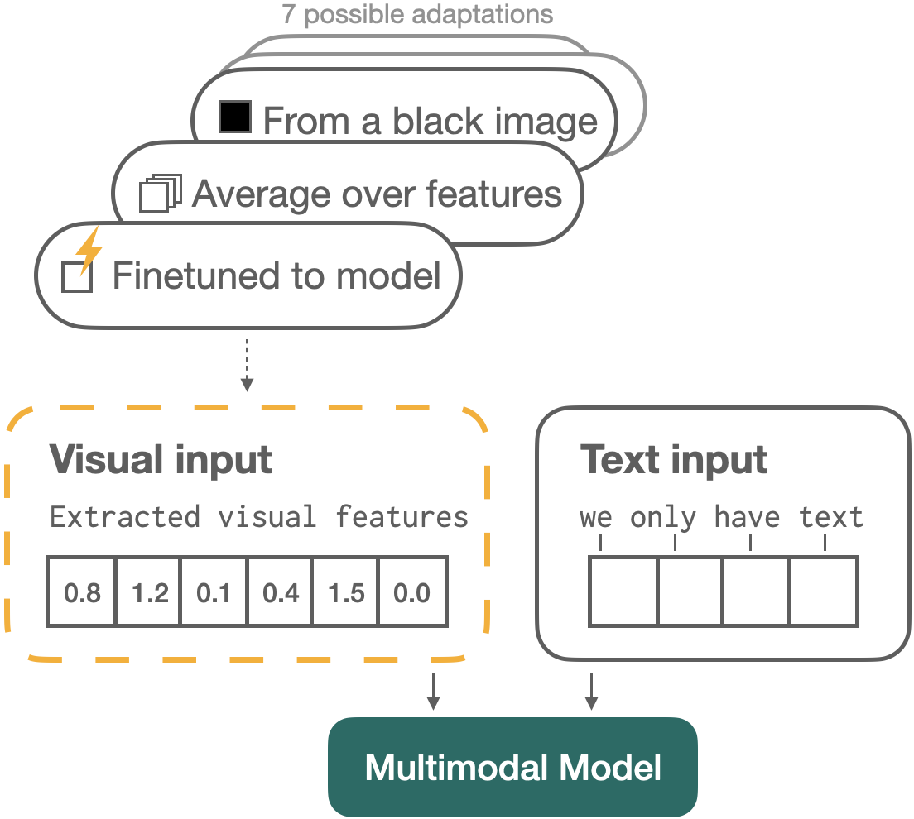
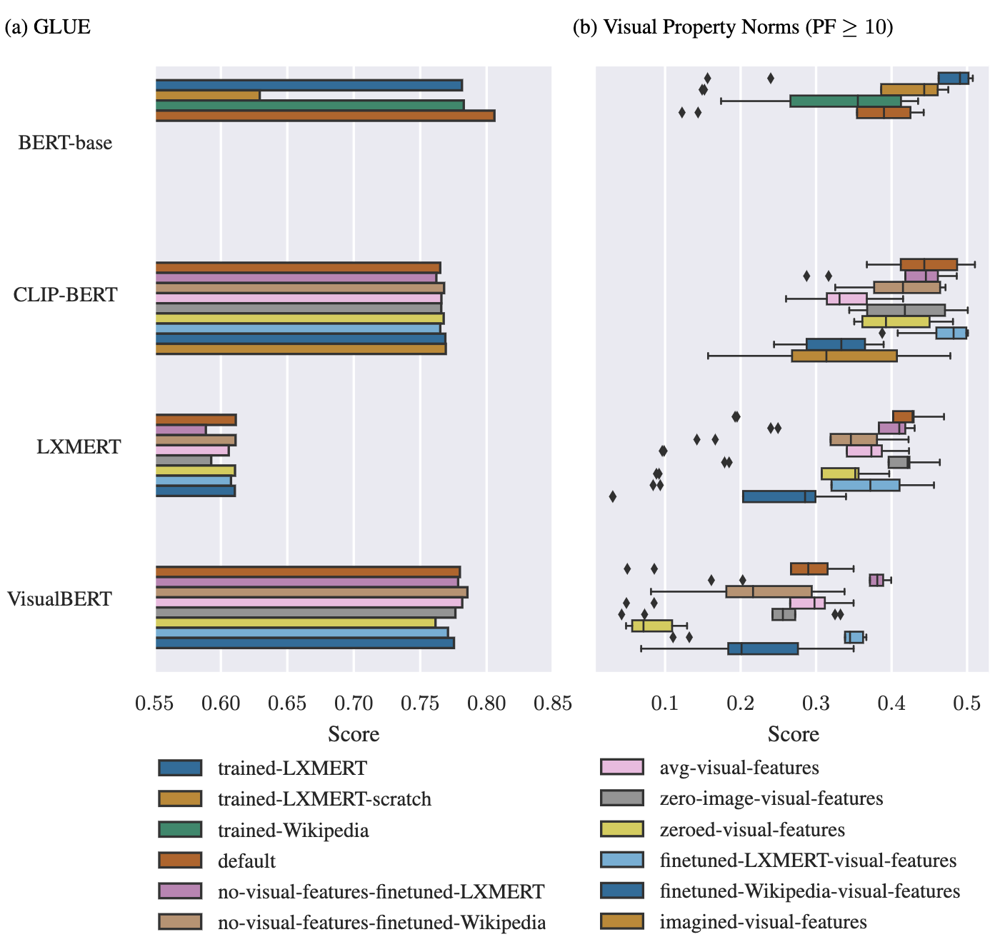

# Adapt Pre-trained Vision-and-Language Models to a Text-only Input

This repo contains the code for the COLING 2022 paper [How to Adapt Pre-trained Vision-and-Language Models to a Text-only Input?](https://aclanthology.org/2022.coling-1.494.pdf).

## Where to start?

This repo is segmented into five main parts:

1. [data](data) contains 
    * Wikipedia and LXMERT data necessary for training BERT baselines and for making the text-only adaptations that depend on LXMERT or Wikipedia data,
    * An analysis of these datasets, and calculations used to make the dataset sizes equal in number of tokens, and
    * The code necessary for downloading and formatting the Wikipedia and LXMERT data sets necessary for the project.
2. [models](models) contains 
    * Code necessary for attaining the models that haven't already been pre-trained and released. These are:
        * The BERT baselines trained on visual copora (`trained-LXMERT`, `trained-LXMERT-scratch` and `trained-Wikipedia`),
        * CLIP-BERT in general
    * Model weights used for all evaluations in the project, or ways to acquire them.
3. [adaptations](adaptations) contains
    * Code for implementing the different text-only adaptations,
    * The visual features used for the `avg-visual-features`, `zero-image-visual-features`, `zeroed-visual-features`, `finetuned-LXMERT-visual-features` and `finetuned-Wikipedia-visual-features` adaptations.
    * The model weights for the models that have been adapted through text-only fine-tuning (`no-visual-features-finetuned-LXMERT` and `no-visual-features-finetuned-Wikipedia`)
4. [GLUE](GLUE) contains code necessary for the GLUE evaluation performed in the project.
5. [visual_property_norms](visual_property_norms) contains code necessary for running the Visual Property Norms evaluation.

Parts 4 and 5 essentially make up the results of the paper.

## Results

## Acknowledgements
This work wouldn't be possible without [Huggingface](https://huggingface.co/) and the [LXMERT repo](https://github.com/airsplay/lxmert), we thank you for your work.
